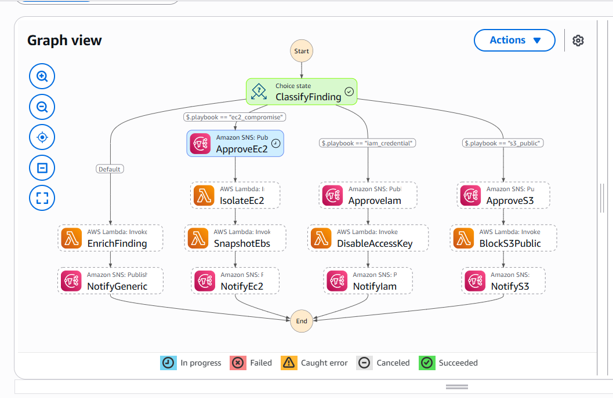
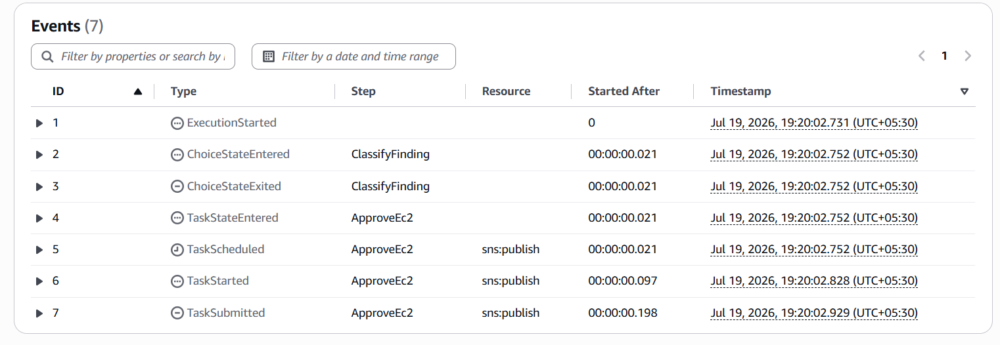
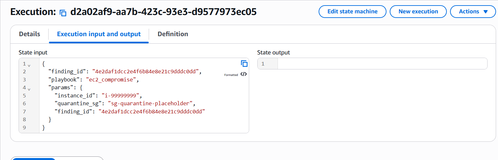

# CloudSentinel

**An AWS-native cloud security operations platform.** CloudSentinel ingests security findings across a multi-account AWS organization, classifies threats with machine learning, responds through human-approved SOAR remediation playbooks, and surfaces everything through an authenticated SOC dashboard.

Built as a portfolio project to demonstrate cloud security engineering end to end — from multi-account governance and detection pipelines through ML inference, automated response, and a production-grade web front end.

**Live:** dashboard at `https://d2tb90osqfrb0m.cloudfront.net` · API docs at `https://api.cloudsentinel-soc.com/docs`
*(The Fargate/ALB serving layer is deployed on demand and torn down between sessions for cost control; it redeploys from code in ~7 minutes.)*

---

## What it does

| Stage | Capability |
|-------|-----------|
| **Detect** | Ingests findings from GuardDuty, Security Hub, and Inspector across all accounts, normalizing each source into one common schema. |
| **Classify** | An XGBoost model scores network flows for intrusion (trained on CICIDS2017 — AUC 0.99997, F1 0.9978). |
| **Respond** | High-severity findings trigger a Step Functions SOAR workflow that routes each threat to the correct playbook and **pauses at a human approval gate** before any destructive action. |
| **Observe** | A React SOC dashboard shows live severity/source charts, a filterable findings table, remediation status, and an interactive prediction tool. |
| **Protect** | Cognito authentication with JWT validation enforced on **every** API route — the data cannot be reached by bypassing the UI. |

---

## Architecture

```
AWS Organization (Control Tower, 4 accounts)
├── Management    — org root, DNS apex, delegation role
├── Log Archive   — centralized CloudTrail
├── Audit         — security services + the entire platform
└── Workload      — ML training environment

Detection pipeline (Audit)
  GuardDuty / Security Hub / Inspector
    → EventBridge → Kinesis → Lambda normalizer → DynamoDB

SOAR layer (Audit)
  EventBridge (severity ≥ 7) → Router Lambda
    → Step Functions → [SNS approval gate] → Executor Lambda
    → isolate EC2 / disable IAM key / block S3 / enrich

Serving layer (Audit)
  FastAPI (Docker) → ECS Fargate → ALB (HTTPS)  →  api.cloudsentinel-soc.com
  React SPA → S3 → CloudFront (HTTPS)
  Cognito user pool → PKCE login → JWT → verified by the API

ML (Workload)
  SageMaker Studio → CICIDS2017 → XGBoost → model promoted to Audit for serving
```

---

## Tech stack

| Layer | Tools |
|-------|-------|
| Infrastructure as Code | AWS CDK (TypeScript), CloudFormation |
| Multi-account | Organizations, Control Tower, IAM Identity Center |
| Security services | GuardDuty, Security Hub, Inspector, AWS Config |
| Ingestion | EventBridge, Kinesis Data Streams, Lambda (Python) |
| Storage | DynamoDB (severity GSI), S3 |
| ML | SageMaker Studio, XGBoost, pandas / NumPy, CICIDS2017 |
| SOAR | Step Functions (approval gates via task tokens), SNS, Lambda |
| API | FastAPI, Pydantic, Uvicorn, Docker, ECS Fargate, ALB, ECR |
| Auth | Cognito (hosted UI, PKCE), python-jose (JWT/JWKS verification) |
| Frontend | React, TypeScript, Vite, Recharts, axios |
| Hosting / DNS / TLS | S3 + CloudFront (OAC), Route 53, ACM |
| Ops | CloudWatch, AWS Budgets, least-privilege IAM |

---

## Automated response in action

The SOAR loop was exercised end to end with simulated attack findings (SSH brute force, crypto-mining, DNS exfiltration, C&C activity). A high-severity finding is classified, routed to the matching playbook, and the workflow **pauses at a human approval gate** before isolating any resource.

| Execution graph | Event timeline | Execution input |
|---|---|---|
|  |  |  |

The graph shows `ClassifyFinding` routing a C&C/exfiltration finding down the `ec2_compromise` branch to `ApproveEc2`, where it waits for a human decision before the `IsolateEc2 → SnapshotEbs` remediation runs.

---

## Engineering decisions

Architecture decisions are recorded as ADRs in [`docs/adr/`](docs/adr/):

- **[0001 — Fargate over EKS](docs/adr/0001-compute-fargate-over-eks.md):** right-sized compute; Kubernetes would be over-engineering for a single API service.
- **[0002 — CDK for durable infra, scripts for one-time org calls](docs/adr/0002-org-security-cdk-vs-cli.md):** honest separation rather than a brittle all-CDK facade.
- **[0003 — SageMaker domain bootstrapped via console](docs/adr/0003-sagemaker-domain-console-bootstrap.md):** the domain is environment setup; the pipeline is the asset and lives in code.
- **[0004 — Decommission OpenSearch](docs/adr/0004-decommission-opensearch.md):** it had no producers or consumers while costing ~$25/month, so it was measured and removed.

Other decisions worth naming:

- **Human-in-the-loop remediation.** Blind auto-remediation is an anti-pattern; destructive playbooks pause for approval, and a SAFE_MODE flag makes the workflow testable without touching real resources.
- **PKCE, not implicit grant.** Implicit grant is deprecated in OAuth 2.1 (tokens leak via URL fragments); a security platform should not ship a deprecated auth flow.
- **Auth enforced at the API, not just the UI.** Frontend-only auth is theater — unauthenticated requests to the data routes return 401.
- **Cross-account DNS delegation, fully IaC.** The management account owns the apex zone; the audit account owns a delegated `api.` subdomain, so its cert, records, and ALB are all same-account. The persistent DNS/cert stack is separated from the ephemeral compute stack so the latter tears down cleanly every time.
- **Runtime configuration.** The dashboard fetches its API URL at startup, so the built artifact isn't coupled to a backend URL.

---

## Repository layout

```
cdk/          CDK app — all infrastructure (lib/stacks, lambda/, bin/)
backend/      FastAPI service (app/), Dockerfile
frontend/     React + TypeScript SOC dashboard (Vite)
ml/           CICIDS2017 processing, training, evaluation, models
playbooks/    SOAR remediation playbook definitions
scripts/      attack simulation + load testing
docs/adr/     architecture decision records
screenshots/  evidence captures
```

---

## Status

Built over ~27 working days. Everything described above is deployed and verified: the pipeline ingests live findings, the model scores flows, the SOAR loop pauses at its approval gate, and unauthenticated API calls are rejected.

**Deferred / in progress:**
- Multiclass attack classifier (blocked on a SageMaker training-quota increase; a binary classifier is trained and serving).
- Formal Well-Architected review and cost report.
- Final documentation and demo video.

This is a production-*grade* portfolio project — screenshot-backed and conservatively described — not a commercial production service.

---

## License

MIT
